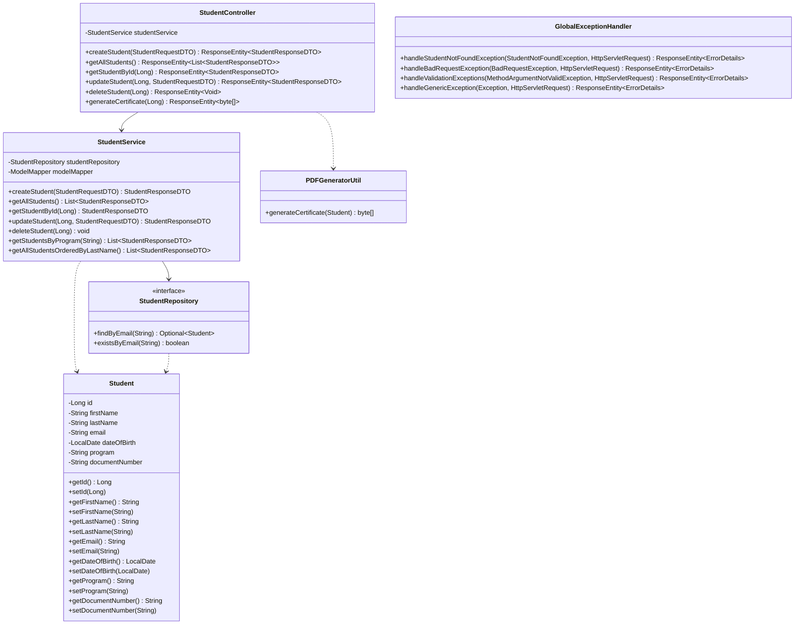

```mermaid
classDiagram
    class Student {
        -Long id
        -String firstName
        -String lastName
        -String email
        -LocalDate dateOfBirth
        -String program
        -String documentNumber
        +getId() Long
        +setId(Long)
        +getFirstName() String
        +setFirstName(String)
        +getLastName() String
        +setLastName(String)
        +getEmail() String
        +setEmail(String)
        +getDateOfBirth() LocalDate
        +setDateOfBirth(LocalDate)
        +getProgram() String
        +setProgram(String)
        +getDocumentNumber() String
        +setDocumentNumber(String)
    }

    class StudentRepository {
        <<interface>>
        +findByEmail(String) Optional~Student~
        +existsByEmail(String) boolean
    }

    class StudentService {
        -StudentRepository studentRepository
        -ModelMapper modelMapper
        +createStudent(StudentRequestDTO) StudentResponseDTO
        +getAllStudents() List~StudentResponseDTO~
        +getStudentById(Long) StudentResponseDTO
        +updateStudent(Long, StudentRequestDTO) StudentResponseDTO
        +deleteStudent(Long) void
        +getStudentsByProgram(String) List~StudentResponseDTO~
        +getAllStudentsOrderedByLastName() List~StudentResponseDTO~
    }

    class StudentController {
        -StudentService studentService
        +createStudent(StudentRequestDTO) ResponseEntity~StudentResponseDTO~
        +getAllStudents() ResponseEntity~List~StudentResponseDTO~~
        +getStudentById(Long) ResponseEntity~StudentResponseDTO~
        +updateStudent(Long, StudentRequestDTO) ResponseEntity~StudentResponseDTO~
        +deleteStudent(Long) ResponseEntity~Void~
        +generateCertificate(Long) ResponseEntity~byte[]~
    }

    class GlobalExceptionHandler {
        +handleStudentNotFoundException(StudentNotFoundException, HttpServletRequest) ResponseEntity~ErrorDetails~
        +handleBadRequestException(BadRequestException, HttpServletRequest) ResponseEntity~ErrorDetails~
        +handleValidationExceptions(MethodArgumentNotValidException, HttpServletRequest) ResponseEntity~ErrorDetails~
        +handleGenericException(Exception, HttpServletRequest) ResponseEntity~ErrorDetails~
    }

    class PDFGeneratorUtil {
        +generateCertificate(Student) byte[]
    }

    StudentController --> StudentService
    StudentService --> StudentRepository
    StudentService ..> Student
    StudentRepository ..> Student
    StudentController ..> PDFGeneratorUtil
```
